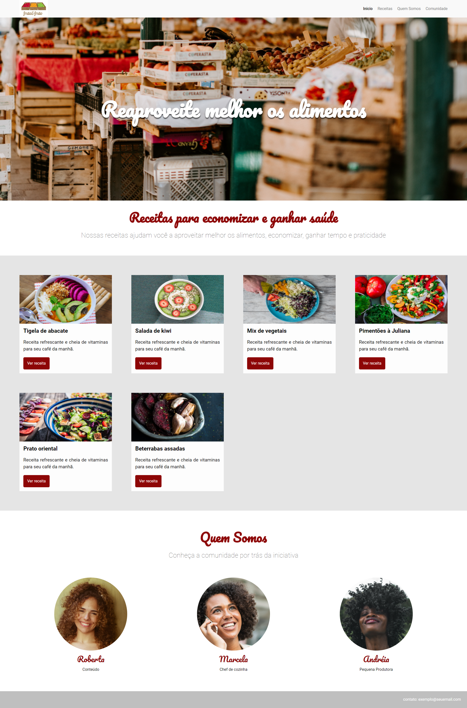

# Site de Receitas

## Visão Geral

### Projeto de um Site de Receitas onde são ensinadas receitas para uma alimentação mais saudável e nutritiva.
#

⏳ Projeto realizado em 3 dias.
#
## Construido com:
- HTML Semântico
- CSS 

## Funcionalidades
- Site de receitas para alimentação mais saudável.

## O que eu aprendi:
- Flexbox
- layout Responsivo
- CSS 
  - Metodologia BEM (Block, Element, Modifier)
  - Metodologia Atomic Design

## Link

Veja o projeto aqui: [Acessar🌍](https://devhiderlan.github.io/projeto-site-de-receitas/)

## Autor

Hiderlan Santana: [Linkedin](https://www.linkedin.com/in/hiderlan-santana/)
